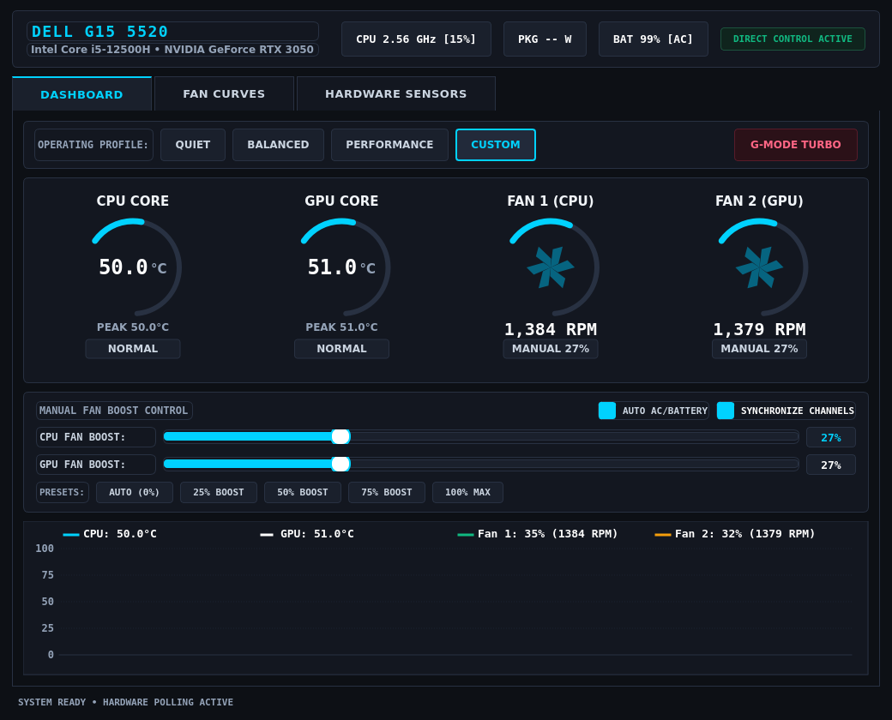
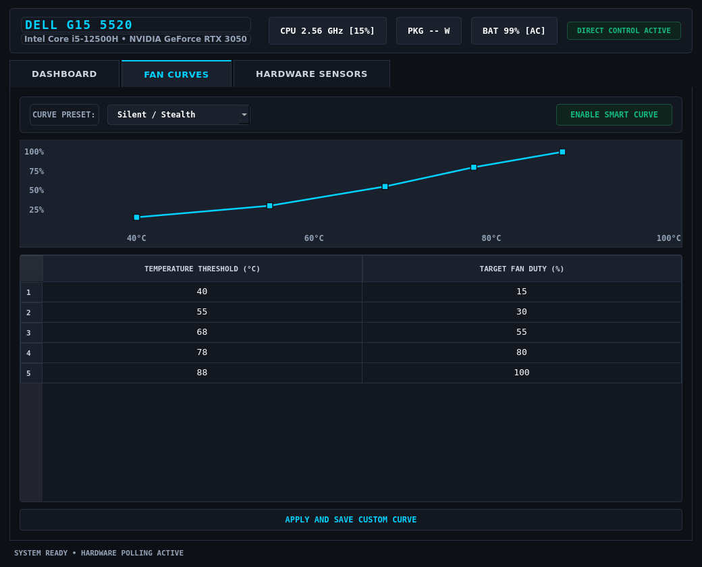
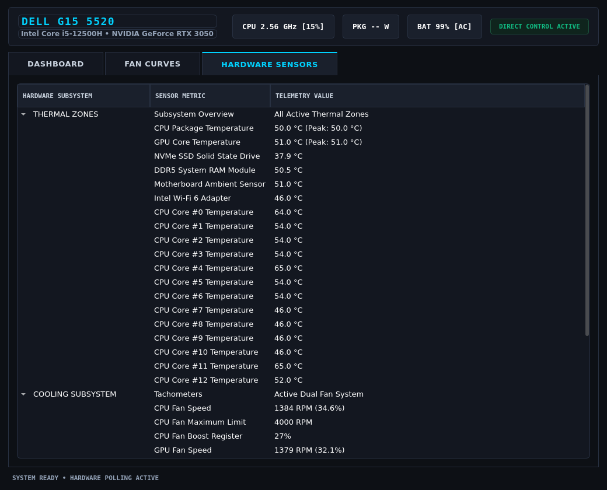

# Dell G15 5520 Thermal & Fan Command Center for Linux

A comprehensive, industrial-grade hardware fan controller, thermal profile manager, and telemetry monitor engineered specifically for the **Dell G15 5520** (Intel Core i5-12500H / i7-12700H + NVIDIA GeForce RTX 3050 / 3060) and compatible Dell G-Series / Alienware laptops on Linux.

This utility brings complete Alienware Command Center (AWCC) functionality to Linux, restoring native **G-Mode Turbo (Game Shift 100% Fans)**, direct dual-fan manual boost controls, intelligent background fan curves with hysteresis protection, power-source auto-adaptation, on-screen OSD notifications, and comprehensive hardware sensor telemetry.



---

## Table of Contents

- [Screenshots & Interface Overview](#screenshots--interface-overview)
- [Key Features](#key-features)
- [How It Works (Hardware & Linux Kernel Architecture)](#how-it-works-hardware--linux-kernel-architecture)
- [System Requirements](#system-requirements)
- [Installation Guide](#installation-guide)
  - [Option 1: Debian / Ubuntu / Kali Linux (.deb Package)](#option-1-debian--ubuntu--kali-linux-deb-package-recommended)
  - [Option 2: Arch Linux / Manjaro (AUR PKGBUILD)](#option-2-arch-linux--manjaro-aur-pkgbuild)
  - [Option 3: Python PIP Package](#option-3-python-pip-package)
  - [Option 4: Manual Script Installation](#option-4-manual-script-installation)
- [Setting Up Direct Hardware Permissions (Passwordless Operation)](#setting-up-direct-hardware-permissions-passwordless-operation)
- [Graphical Interface (GUI) Guide](#graphical-interface-gui-guide)
- [Command-Line (CLI) Reference](#command-line-cli-reference)
- [Headless Background Daemon & Systemd Service](#headless-background-daemon--systemd-service)
- [Binding the G-Key (Fn + F9) in Linux](#binding-the-g-key-fn--f9-in-linux)
- [Smart Fan Curve Engine & Auto Power Adaptation](#smart-fan-curve-engine--auto-power-adaptation)
- [Monitored Hardware Sensors](#monitored-hardware-sensors)
- [Uninstallation Guide](#uninstallation-guide)
- [Troubleshooting & FAQ](#troubleshooting--faq)
- [License](#license)

---

## Screenshots & Interface Overview

### 1. Main Dashboard
Real-time thermal monitoring, dual-fan RPM tachometers, operating profile switcher (`Quiet`, `Balanced`, `Performance`, `Custom`, `G-Mode Turbo`), manual boost sliders, auto power-source adaptation, and live oscilloscope telemetry timeline.


### 2. Smart Fan Curve Controller
Configurable dynamic fan curve editor with linear interpolation, hysteresis surge protection, and preset profiles.



### 3. Hardware Sensor Telemetry Tree
High-density hierarchical tree displaying CPU package & per-core temperatures, GPU, NVMe SSD, DDR5 RAM, ambient chassis sensor, Intel RAPL package power wattage, and battery flow.



---

## Key Features

- **Thermal Profile Switching**:
  - **Quiet Mode**: Low acoustic profile and lowered fan thresholds for quiet office/library environments.
  - **Balanced Mode**: Standard intelligent Dell dynamic firmware thermal curve.
  - **Performance Mode**: Unlocks higher power envelopes and aggressive fan curves.
  - **G-Mode Turbo (Game Shift)**: 1-Click hardware toggle that pins CPU and GPU fans to 100% boost (~4000 RPM CPU / ~4300 RPM GPU) for maximum cooling under intense gaming/workloads.
  - **Custom Mode**: Independent manual fan boost sliders (0% to 100%).
- **Headless Smart Fan Curve Background Daemon & Systemd Service**:
  - Run as a headless console daemon (`dell-g15-fan --daemon`) or as a systemd user service (`dell-g15-fan --service-install`) that auto-starts on system boot.
- **Desktop OSD Notifications**:
  - Instant on-screen alerts when pressing the physical G-Key (Fn + F9) or switching thermal profiles.
  - Critical thermal surge safety popups if temperatures exceed 95 deg C for more than 5 consecutive seconds.
- **Intelligent Auto Power-Source Adaptation**:
  - Dynamically switches to `Quiet / Power-Saver` mode when unplugging AC power (Battery) to maximize battery life, and automatically restores `Balanced` mode when connected to AC main power.
- **Precision Hardware Tachometers & Telemetry**:
  - Live RPM tachometers for both CPU and GPU cooling fans with animated turbine indicators.
  - Instantaneous dual-core thermal meters with peak temperature tracking.
  - Intel RAPL CPU Package Power (Watts), CPU clock frequency (GHz), and total load (%).
  - Real-time oscilloscope sparkline graph tracking temperatures and fan speeds.
- **Smart Fan Curve Engine**:
  - Background loop calculating dynamic fan speeds via linear interpolation.
  - Built-in hysteresis protection (2.0 deg C threshold) to eliminate annoying fan pulsing/cycling.
  - Built-in presets (*Silent/Stealth*, *Balanced Dynamic*, *Aggressive Performance*, *Maximum Turbo*) plus an editable 5-point threshold table.
- **System Tray Integration**:
  - Minimizes to the system tray with live temperature/RPM tooltips and a right-click quick menu.
- **Full CLI & Hotkey Integration**:
  - Fast, scriptable command-line interface with formatted ASCII telemetry tables.
  - One-command G-Mode toggle designed for global keyboard shortcut integration.
- **Passwordless Sysfs Operation**:
  - Includes automated udev rules so non-root users can adjust fan speeds, monitor RAPL package power, and switch profiles without password prompts.

---

## How It Works (Hardware & Linux Kernel Architecture)

The application communicates directly with Dell's Embedded Controller (EC) via Linux kernel sysfs and ACPI drivers:

```text
+-------------------------------------------------------------------------+
|                  Dell G15 Fan Command Center Suite                      |
|      (PyQt6 GUI  /  CLI Engine  /  Fan Curve Daemon  /  Systemd Unit)   |
+------------------------------------+------------------------------------+
                                     |
                     +---------------+---------------+
                     |   DellFanBackend Controller   |
                     +---------------+---------------+
                                     |
        +----------------------------+----------------------------+
        |                            |                            |
        v                            v                            v
+--------------------+      +--------------------+      +--------------------+
|   alienware_wmi    |      |      dell_smm      |      |      ACPI WMI      |
|    (fan*_boost)    |      |    (tachometers)   |      |  platform-profile  |
+--------------------+      +--------------------+      +--------------------+
        |                            |                            |
        +----------------------------+----------------------------+
                                     |
                                     v
                     +-------------------------------+
                     |    Dell G15 5520 Hardware     |
                     | (Dual Fans, EC, Thermal Zones)|
                     +-------------------------------+
```

### Hardware Register Mapping:
- **Fan Boost Registers**: `/sys/class/hwmon/hwmon5/fan1_boost` and `fan2_boost` (Native integer range `0 to 100%`).
- **Fan Tachometers**: `/sys/class/hwmon/hwmon7/fan1_input` (CPU RPM) and `fan2_input` (GPU RPM).
- **Thermal Profiles**: `/sys/class/platform-profile/platform-profile-0/profile` (`quiet`, `balanced`, `balanced-performance`, `performance`, `custom`).
- **CPU Package Power**: `/sys/class/powercap/intel-rapl*/energy_uj` (Calculated real-time wattage consumed by Intel CPU Package).

---

## System Requirements

- **Supported Laptops**: Dell G15 5520, 5521, 5525 (and compatible Alienware / Dell G-Series laptops).
- **Supported Linux Distributions**: Kali Linux, Debian, Ubuntu, Linux Mint, Fedora, Arch Linux, Pop!_OS, Manjaro.
- **Kernel Requirement**: Linux Kernel 5.15+ (Kernel 6.x recommended with `alienware_wmi` and `dell_smm_hwmon` loaded).
- **Python**: Python 3.8 or newer.

---

## Installation Guide

### Option 1: Debian / Ubuntu / Kali Linux (`.deb` Package) (Recommended)

Build and install the standalone `.deb` package with one command:

```bash
git clone https://github.com/cypher-21/DELL_G15_5520_FAN_CONTROL.git
cd DELL_G15_5520_FAN_CONTROL
./build_deb.sh
sudo apt install ./dell-g15-fan_2.0.0_all.deb
```

---

### Option 2: Arch Linux / Manjaro (AUR PKGBUILD)

```bash
git clone https://github.com/cypher-21/DELL_G15_5520_FAN_CONTROL.git
cd DELL_G15_5520_FAN_CONTROL
makepkg -si
```

---

### Option 3: Python PIP Package

```bash
git clone https://github.com/cypher-21/DELL_G15_5520_FAN_CONTROL.git
cd DELL_G15_5520_FAN_CONTROL
pip install .
```

---

### Option 4: Manual Script Installation

#### 1. Install Dependencies:

##### Debian / Ubuntu / Kali Linux:
```bash
sudo apt update
sudo apt install -y python3 python3-pyqt6 python3-psutil libnotify-bin git
```

##### Arch Linux / Manjaro:
```bash
sudo pacman -S python python-pyqt6 python-psutil libnotify git
```

##### Fedora / RHEL:
```bash
sudo dnf install -y python3 python3-pyqt6 python3-psutil libnotify git
```

#### 2. Run the Installer:
```bash
chmod +x install.sh setup_permissions.sh main.py dell_g15_fan_cli.py dell_g15_fan_gui.py
./install.sh
```

---

## Setting Up Direct Hardware Permissions (Passwordless Operation)

To allow the application to adjust fan speeds, monitor Intel RAPL CPU power, and switch profiles without prompting for `sudo` on every action:

```bash
sudo ./setup_permissions.sh
```

This installs `/etc/udev/rules.d/99-dell-g15-fan.rules` and permanently configures hardware permissions across system reboots.

---

## Graphical Interface (GUI) Guide

### Launching the GUI:
```bash
# Using the desktop launcher or terminal command:
dell-g15-fan
```

### Dashboard Features:
1. **Operating Profile Bar**: Switch between `QUIET`, `BALANCED`, `PERFORMANCE`, `CUSTOM`, and `G-MODE TURBO`.
2. **Radial Precision Gauges**: View real-time CPU & GPU core temperatures, fan RPM speeds, and active boost modes.
3. **Manual Fan Boost Faders**: Drag sliders to set direct boost levels (0% to 100%) or click quick presets (`AUTO`, `25% BOOST`, `50% BOOST`, `75% BOOST`, `100% MAX`).
4. **Auto Power-Source Adaptation**: Check `AUTO AC/BATTERY` to enable automatic profile switching when plugging/unplugging the power cord.
5. **Live Oscilloscope Chart**: Visualizes temperature trends and fan activity over the last 60 seconds.

---

## Command-Line (CLI) Reference

The CLI utility provides fast, scriptable control over all hardware functions without opening the GUI.

### Command Reference Table

| Flag | Argument | Description |
|---|---|---|
| `-s`, `--status` | None | Display complete formatted ASCII telemetry table |
| `-g`, `--gmode-toggle` | None | Instant toggle between G-Mode Turbo (100% fans) and Balanced (with OSD popup) |
| `--gmode-on` | None | Force G-Mode Turbo ON (100% fan boost) |
| `--gmode-off` | None | Force G-Mode Turbo OFF (return to Balanced profile) |
| `-m`, `--mode` | `quiet` / `balanced` / `performance` / `custom` | Set ACPI platform thermal profile |
| `-f`, `--fan` | `0` - `100` | Set boost percentage for both CPU and GPU fans (0-100%) |
| `--cpu-fan` | `0` - `100` | Set CPU fan boost percentage independently |
| `--gpu-fan` | `0` - `100` | Set GPU fan boost percentage independently |
| `--daemon` | None | Run headless smart fan curve engine in console |
| `--curve-preset` | Preset Name | Select curve profile for daemon (`Silent / Stealth`, `Balanced Curve`, `Aggressive Cooling`) |
| `--service-install` | None | Install and enable systemd user service (auto-starts on boot) |
| `--service-status` | None | Check status of systemd user service |
| `--service-remove` | None | Stop and remove systemd user service |
| `--notify` | None | Test desktop OSD notification |
| `--monitor` | None | Live terminal dashboard updating every 1.5 seconds |
| `--install-rules` | None | Install udev permissions rules (passwordless sysfs access) |

### CLI Examples

#### Check System Status:
```bash
dell-g15-fan --status
```

#### Toggle G-Mode Turbo:
```bash
dell-g15-fan --gmode-toggle
```

#### Set Manual Fan Speed:
```bash
# Set both fans to 50% boost
dell-g15-fan --fan 50

# Return fans to automatic firmware curve
dell-g15-fan --fan 0
```

---

## Headless Background Daemon & Systemd Service

You can run the intelligent fan curve controller in the background without needing the graphical window open.

### 1. Enable Systemd Service (Auto-Start on Boot)

```bash
dell-g15-fan --service-install
```

### 2. Check Service Status & Logs

```bash
dell-g15-fan --service-status

# Or view live systemd logs
journalctl --user -u dell-g15-fan -f
```

### 3. Stop and Remove Service

```bash
dell-g15-fan --service-remove
```

---

## Binding the G-Key (Fn + F9) in Linux

You can configure your laptop's physical **G-Key** (or any custom keyboard shortcut) to toggle G-Mode Turbo instantly with native on-screen OSD popup alerts.

### GNOME / Kali / Ubuntu:
1. Open **Settings** -> **Keyboard** -> **Keyboard Shortcuts** -> **View and Customize Shortcuts** -> **Custom Shortcuts**.
2. Click **Add Shortcut (+)**:
   - **Name**: `Dell G-Mode Turbo Toggle`
   - **Command**: `dell-g15-fan --gmode-toggle`
   - **Shortcut**: Press <kbd>F9</kbd> (or <kbd>Fn</kbd> + <kbd>F9</kbd>, or <kbd>Super</kbd> + <kbd>G</kbd>).
3. Click **Add**.

### KDE Plasma:
1. Open **System Settings** -> **Shortcuts** -> **Custom Shortcuts**.
2. Click **Edit** -> **New** -> **Global Shortcut** -> **Command/URL**.
3. Set Trigger to <kbd>F9</kbd> and Action to `dell-g15-fan --gmode-toggle`.

### XFCE / i3 / Sway:
Add the following line to your `~/.config/i3/config` or `~/.config/sway/config`:
```bash
bindsym XF86Launch1 exec --no-startup-id dell-g15-fan --gmode-toggle
# Or for F9:
bindsym F9 exec --no-startup-id dell-g15-fan --gmode-toggle
```

---

## Smart Fan Curve Engine & Auto Power Adaptation

The built-in Smart Fan Curve Engine operates as a lightweight background thread or daemon that continuously computes target fan speeds based on real-time CPU and GPU temperatures.

### Key Capabilities:
1. **Linear Interpolation**: Computes the exact fan speed between defined temperature thresholds.
2. **Hysteresis Algorithm**: Incorporates a 2.0 deg C deadband. Fans immediately ramp up when temperature rises, but only step down once temperature drops past the buffer threshold, preventing annoying cycling.
3. **Auto Power-Source Adaptation**: Dynamically switches to quiet thermal profiles on battery power to extend battery runtime, and restores full performance curves when connected to AC main power.
4. **Thermal Surge Safety**: Automatically alerts the user via desktop OSD notifications if temperatures exceed 95 deg C.

---

## Monitored Hardware Sensors

The application monitors all available hardware sensors exposed by the Linux kernel:

| Sensor Category | Subsystem | Metrics Exposed |
|---|---|---|
| **CPU Package & Cores** | `coretemp` (`hwmon3`) | Package temperature, Per-Core temps (#0 to #11), Peak tracking |
| **GPU Core** | `dell_smm` (`hwmon7`) / NVIDIA sysfs | Live temperature, Peak tracking |
| **Cooling Fans** | `alienware_wmi` (`hwmon5`) & `dell_smm` (`hwmon7`) | Fan 1 (CPU) RPM, Fan 2 (GPU) RPM, Boost registers (0-100%) |
| **Solid State Drive** | `nvme` (`hwmon1`) | NVMe SSD composite temperature |
| **System Memory** | `spd5118` (`hwmon4`) | DDR5 System RAM thermal sensor |
| **Motherboard Ambient** | `dell_smm` (`hwmon7`) | Chassis ambient thermal zone |
| **Network Adapter** | `iwlwifi` (`hwmon2`) | Intel Wi-Fi 6 adapter temperature |
| **CPU Power & Clock** | `intel-rapl` & `psutil` | RAPL Package Power (Watts), CPU core clock (GHz), CPU load (%) |
| **Battery & Power** | `BAT0` / `AC` (`hwmon0`) | State of charge (%), Voltage (V), Discharge flow (W), AC status |

---

## Uninstallation Guide

To completely remove the application, desktop shortcuts, application icons, systemd user services, and udev rules:

### Automated Removal:
```bash
./uninstall.sh
```

### If Installed via `.deb` Package:
```bash
sudo apt remove dell-g15-fan
```

### If Installed via Arch Linux AUR:
```bash
sudo pacman -R dell-g15-fan
```

---

## Troubleshooting & FAQ

### 1. Fans are not responding to manual sliders
- Run `sudo ./setup_permissions.sh` to grant non-root access to the sysfs boost nodes.
- Verify that `alienware_wmi` is loaded: `lsmod | grep alienware_wmi`. If not, load it: `sudo modprobe alienware_wmi`.

### 2. RPM reading shows 0 RPM
- The fan tachometer requires the `dell_smm_hwmon` kernel module. Check if active: `lsmod | grep dell_smm_hwmon`. If not, load it: `sudo modprobe dell_smm_hwmon restricted=0 ignore_dmi=1`.

### 3. CPU Package Power shows `-- W`
- Run `sudo ./setup_permissions.sh` to grant non-root read access to `/sys/class/powercap/intel-rapl*`.

---

## License

This project is licensed under the MIT License. See [LICENSE](LICENSE) for details.
